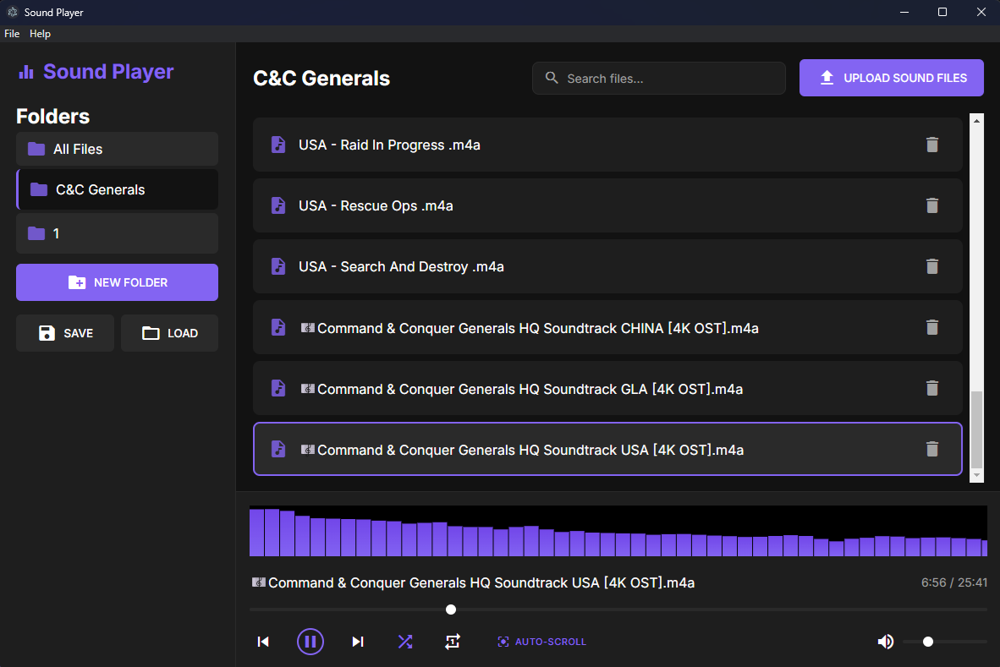

# Sound Player 🎵

[](https://opensource.org/licenses/MIT)
[](https://www.electronjs.org/)
[](https://nodejs.org/)

Sound Player is a sleek, modern audio player that brings your music to life with stunning spectrum visualization.

This cross-platform application offers intuitive playlist management, smart folder organization, and essential playback features like shuffle and repeat.

With its beautiful dark theme interface and responsive design, Sound Player makes managing and enjoying your music collection a breeze.

Whether you're organizing your library, creating custom playlists, or just enjoying your favorite tracks with crystal-clear audio playback, Sound Player provides all the tools you need in an elegant, easy-to-use package.



## ✨ Features

- 🎵 Audio playback with spectrum visualization
- 🔍 **Real-time search** - Find your music instantly as you type
- 📁 Folder organization for your music
- 📋 Playlist management with shuffle and repeat
- 🎨 Modern dark theme interface
- 💾 Save/Load library functionality
- 🔊 Volume and seek controls
- 📱 Responsive design

## 🚀 Quick Start

### Prerequisites

- [Node.js](https://nodejs.org/) (v14 or higher)
- npm (comes with Node.js)

### Installation

#### Method 1: Download Executable (Recommended)

1. Download the appropriate file for your system:
   - Windows: `SoundPlayer-Setup.exe` (installer) or `SoundPlayer-Portable.exe`
   - macOS: `SoundPlayer.dmg`
   - Linux: `SoundPlayer.AppImage` or `soundplayer.deb`
2. Run the downloaded file
3. Start enjoying your music!

#### Method 2: Build from Source

```bash
# Clone the repository
git clone https://github.com/yourusername/soundplayer.git
cd soundplayer

# Install dependencies
npm install

# Start the application
npm start

# Build for your platform (optional)
npm run build
```

## 📖 Usage

1. **Launch the Application**
   - Double-click the executable or run `npm start` if using source code
   - The application will open in a new window

2. **Add Music**
   - Click the "UPLOAD SOUND FILES" button
   - Select one or more audio files
   - Files will be added to your library

3. **Search Your Music**
   - Use the search bar at the top to find files instantly
   - Search is case-insensitive and searches file names
   - Click the "×" button or press Escape to clear search
   - Use `Ctrl+F` to quickly focus the search bar

4. **Organize Music**
   - Create folders using the "NEW FOLDER" button
   - Drag and drop files between folders
   - Use the "All Files" view to see everything

5. **Playback Controls**
   - Play/Pause: Space bar or click play button
   - Next/Previous: Arrow buttons or keyboard arrows
   - Volume: Slider in bottom right
   - Seek: Progress bar below visualization

6. **Playlist Features**
   - Shuffle: Toggle shuffle mode
   - Repeat: Toggle repeat one/all
   - Click tracks to play them

7. **Save/Load Library**
   - Save: Click SAVE button to store your library organization
   - Load: Click LOAD button to restore a previously saved library
   - Note: The library saves file references, not the actual audio files

8. **Application Menu**
   - **File Menu**: Access application controls and exit options
   - **Help Menu**: View application information and credits
   - **About Dialog**: Shows version, creator info, and application details

## ⌨️ Keyboard Shortcuts

- `Space` - Play/Pause
- `→` - Next track
- `←` - Previous track
- `Delete` - Delete selected track
- `Ctrl+F` - Focus search bar
- `Escape` - Clear search (when search bar is focused)
- `Ctrl+Q` / `Cmd+Q` - Exit application

## 🔧 Troubleshooting

### Windows
- If you get audio playback errors, ensure your default audio device is set correctly
- For file permission errors, try running as administrator

### macOS
- If the application doesn't open, check Gatekeeper settings
- For audio permission issues, grant access in System Preferences

### Linux
- If audio doesn't work, ensure ALSA/PulseAudio is installed
- For file access issues, check folder permissions

## 🤝 Contributing

Contributions are welcome! Please feel free to submit a Pull Request.

## 👨‍💻 Author

Created by **@AntDX316**

## 📄 License

This project is licensed under the MIT License - see the [LICENSE](LICENSE) file for details.

## 🙏 Acknowledgments

- Thanks to all contributors who have helped shape Sound Player
- Built with [Electron](https://www.electronjs.org/)